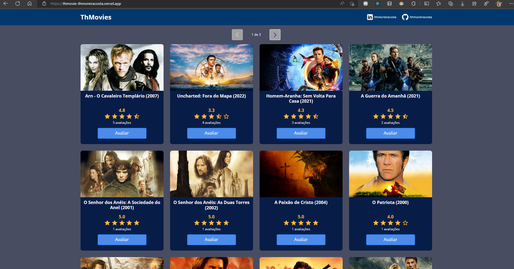

# ThMovies 🎦
## Plataforma para avaliação de filmes 

- Deploy: https://thmovie-thmoreiracosta.vercel.app/

### Tecnologias Utilizadas
- React JS
- Typescript
- Java Spring Boot(backend)
- Html
- CSS
- Bootstrap
- Vite
- Vercel
- Heroku
- MySql
- Twilio

### Habilidades Desenvolvidas
- Aplicação com foco em ReactJS e Typescript no frontend e Java Spring Boot no backend
- Consumo API Java Spring Boot
- Conceitos básicos usando o React com Typescript
- Conceitos básicos OOB com Java Spring Boot

#### Desenvolvido junto com material de aulas da plataforma da DevSuperior

